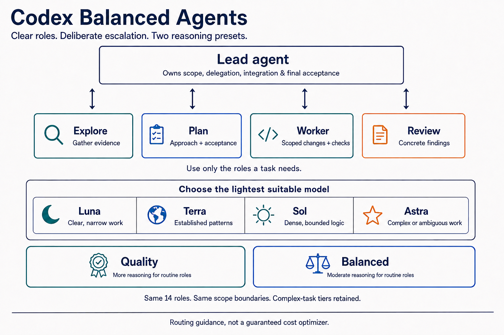

# Codex Balanced Agents

[English](README.md) · [安装](INSTALL.zh-CN.md) · [角色说明](docs/roles.md) · [验证记录](docs/verification.md)

**一套个人使用的 Codex 分工配置：根据任务，决定投入多少推理。**

明确的小任务交给轻量模型；逻辑密集的实现交给有明确边界的 Worker；复杂、模糊的问题交给更深入的调查角色。完成后，再让独立 Reviewer 对照原需求检查。

这个仓库把这种方式整理为 **14 个原生 Codex 角色、两套配置和一个安装器**，面向希望兼顾能力、效率与成本的个人开发者。配置可以直接阅读，也方便按自己的任务调整。



## 选择适合你的方案

| | Quality · 质量优先 | Balanced · 质量与成本均衡 |
| --- | --- | --- |
| Luna 调查／实现角色 | `xhigh` | `medium` |
| Terra 调查／实现角色 | `xhigh` | `medium` |
| Sol、Astra 与规划角色 | 两套相同 | 两套相同 |
| 设计意图 | 日常委派工作也投入更多推理 | 日常委派工作从适中推理开始 |

没有明确偏好时，建议从 **Balanced** 开始。如果更愿意为日常角色投入推理，并接受可能增加的耗时和用量，可以选 **Quality**。名称描述的是配置取向，不代表已经验证的质量差异。两套保留相同的升级路径与工作边界。[完整角色表 →](docs/roles.md)

## 让 agent 帮你安装

把下面这段发给 Codex：

```text
读取 https://raw.githubusercontent.com/LemonCANDY42/codex-balanced-agents/main/INSTALL.zh-CN.md
并安装 Codex Balanced Agents，让我选择 Quality 或 Balanced。
整个流程最多问我两次。保留现有配置；如果缺少模型，先说明并让我选择处理方式，不要静默替换。
```

也可以在终端安装，需要 Python 3.11+ 和已安装的 Codex CLI：

```bash
git clone https://github.com/LemonCANDY42/codex-balanced-agents.git
cd codex-balanced-agents
python3 install.py install
```

第一次选方案，第二次集中确认安装。如果缺少模型或无法检查，第二次可以选择取消，或明确接受“原样安装，但部分角色可能暂时不能运行”。不会逐个模型追问。

安装器只把角色文件和一个使用技能写入 Codex 配置目录；不会覆盖主模型、`config.toml`、全局 `AGENTS.md`、认证或 MCP。遇到不归它管理的同名文件会停止，即使内容相同也不会擅自接管。[安装、切换与卸载 →](INSTALL.zh-CN.md)

## 让 agent 一键卸载

把下面这段发给 Codex：

```text
读取 https://raw.githubusercontent.com/LemonCANDY42/codex-balanced-agents/main/UNINSTALL.zh-CN.md
并从安装时使用的 Codex 目录卸载 Codex Balanced Agents。
先预览确切删除清单，再仅删除通过归属与完整性检查的本项目文件。
保留无关配置和用户修改；遇到冲突就停止。
```

也可在本仓库执行：`python3 install.py uninstall --yes`。
使用 `--dry-run` 可只预览、不改动。[删除边界与恢复说明 →](UNINSTALL.zh-CN.md)

## 实际使用

安装后重新启动 Codex 客户端，可以这样开始：

```text
使用 $codex-balanced-agents 处理这个 bug。
先让 explore_terra 找到归属代码并返回证据，再视需要安排范围明确的 Worker。
完成后让 reviewer_sol 对照原需求审查 diff。
由你负责整合与最终验收，保留无关改动。
```

不必每次启动全部角色。任务很小或高度耦合时，主代理直接完成即可。使用技能提供选择指导，委派由你的请求或项目指导授权；没有后台路由器、自建 agent 运行时，也没有必须走完的四阶段流程。

## 这套配置关注什么

- **先处理不确定性，再执行。** 归属、生命周期等事实还不清楚时，先调查。
- **有理由再升级。** 具体阻塞或复杂边界可以触发更强角色，不能仅凭任务看起来大。
- **实现有范围。** Worker 有负责的边界与验收条件，发现附近的问题不等于获准顺手修改。
- **审查有证据。** Reviewer 给出位置、触发条件和影响，不把个人风格偏好变成新需求。
- **主代理负责收尾。** 子代理返回结果，主代理整合、处理发现并验收。

[使用示例 →](docs/example.md) · [设计依据与参考 →](docs/design.md)

## 使用边界

这是**个人实践配置**，不是 OpenAI 官方预设，也不是已经证明有效的成本优化器。更多推理和更多代理可能增加耗时与 token 消耗，目前没有代表性基准证明两套配置之间的质量、速度或费用差异。

角色提示词不会建立安全隔离。在本仓库核对的 Codex 版本中，子代理继承父会话权限与 MCP；角色内的 sandbox 和委派开关不生效，因此公开配置没有保留这些无效项。“只读”和“不再委派”属于行为要求。[版本依据与验证记录 →](docs/verification.md)

模型可用性取决于账号、服务提供方与客户端。安装器查询 CLI 公布的模型及推理档位目录，这不等于验证了账号权限或实际推理成功。桌面应用与单独安装的 CLI 可能返回不同目录。

## 问题与反馈

遇到安装问题、角色行为不清楚，或有尚未覆盖的使用场景，欢迎[选择 Issue 模板](https://github.com/LemonCANDY42/codex-balanced-agents/issues/new/choose)：问题报告、改进建议或使用疑问。模板字段与提示统一使用英文，内容仍可用中文或英文填写。通过 agent、CLI 或 API 提交时，请按[提交指南](docs/issues.md)填写相同字段。发布前请移除凭据与隐私信息。

目前优先通过 Issue 收集反馈。采用 [MIT 许可](LICENSE)。
